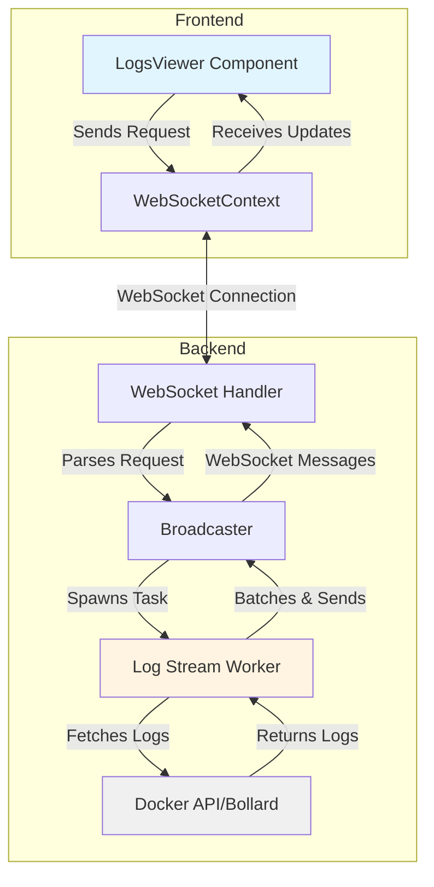
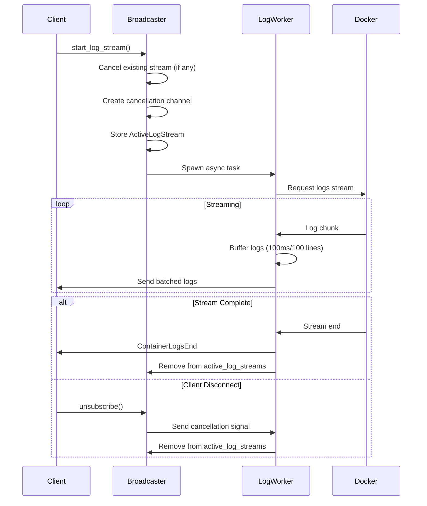
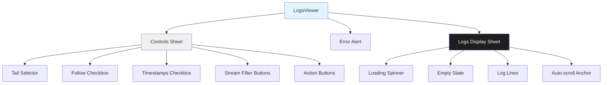
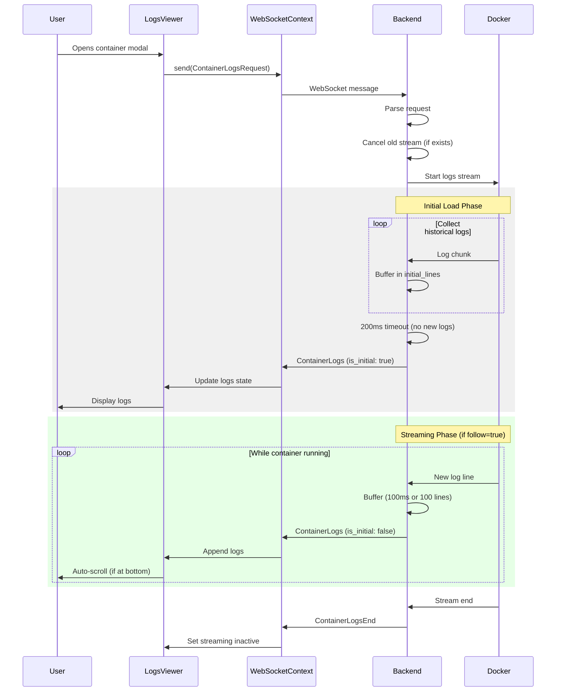
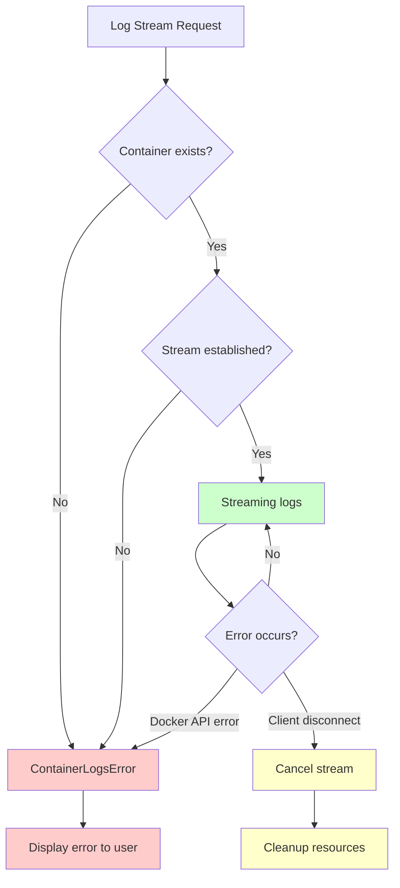

# Container Logs Streaming Feature - Technical Documentation

## Overview

This document explains the implementation of real-time container log streaming functionality added to the Docker Manager application.
The feature enables users to view and stream container logs in real-time through WebSocket connections, providing a terminal-like experience directly in the web interface.

## Table of Contents

1. [Architecture Overview](#architecture-overview)
2. [Backend](#backend)
3. [Frontend](#frontend)
4. [Communication Flow](#communication-flow)
5. [Design Decisions](#design-decisions)
6. [Performance Considerations](#performance-considerations)
7. [Error Handling](#error-handling)

---

## Architecture Overview

The container logs feature uses a bidirectional WebSocket communication pattern where:

- **Frontend** sends log requests with specific parameters (tail count, follow mode, timestamps, etc.)
- **Backend** streams logs from Docker daemon using the Bollard library
- **Real-time updates** are batched and sent to clients efficiently
- **Stream lifecycle** is managed with proper cleanup and cancellation



---

## Backend

### 1. WebSocket Message Types (`backend/src/api/websocket/messages.rs`)

**New Message Structures:**

```rust
pub enum WebSocketMessage {
    // ... existing messages
    ContainerLogsRequest(ContainerLogsRequestData),
    ContainerLogs(ContainerLogsData),
    ContainerLogsEnd(ContainerLogsEndData),
    ContainerLogsError(ContainerLogsErrorData),
}
```

**Key Additions:**

- **`LogLine`**: Represents a single log line with stream type (stdout/stderr) and optional timestamp
- **`ContainerLogsRequestData`**: Client request with configurable parameters (tail, follow, timestamps, stdout/stderr filtering)
- **`ContainerLogsData`**: Batched log lines with `is_initial` flag to distinguish historical from streaming logs
- **`ContainerLogsEndData`**: Signals stream completion
- **`ContainerLogsErrorData`**: Communicates errors during log streaming

---

### 2. Broadcaster Enhancements (`backend/src/api/websocket/broadcaster.rs`)

**Active Stream Management:**

```rust
pub struct ActiveLogStream {
    pub container_id: String,
    pub cancel_tx: tokio::sync::oneshot::Sender<()>,
}

pub struct Broadcaster {
    clients: Arc<RwLock<HashMap<ClientId, mpsc::UnboundedSender<Message>>>>,
    next_client_id: Arc<RwLock<ClientId>>,
    active_log_streams: Arc<RwLock<HashMap<ClientId, ActiveLogStream>>>, // NEW
}
```

**Why Track Active Streams?**

1. **Resource Cleanup**: When a client disconnects, we need to cancel their log streaming task
2. **Single Stream Per Client**: Prevents resource leaks when clients request new logs before previous stream completes
3. **Graceful Cancellation**: Uses oneshot channels for cooperative task cancellation

**Stream Lifecycle:**



**Core Streaming Logic:**

The `stream_logs` function implements a state machine with three phases:

1. **Initial Load Phase**: Collects historical logs
2. **Timeout Detection**: Detects when historical logs are fully loaded (200ms silence)
3. **Streaming Phase**: Buffers and sends new logs as they arrive

**Configuration Values:**

These values are now configurable via the configuration system (see [Configuration](#configuration)):

```rust
let max_tail_lines = state.config.websocket.max_tail_lines;           // Default: 5000
let streaming_buffer_ms = state.config.websocket.streaming_buffer_ms; // Default: 100
let streaming_max_batch = state.config.websocket.streaming_max_batch; // Default: 100
let initial_timeout_ms = state.config.websocket.initial_timeout_ms;   // Default: 200
```

**Dual-Mode Batching:**

```rust
// Time-based batching (every 100ms)
_ = interval.tick(), if !is_initial && request.follow && !buffer.is_empty() => {
    broadcaster.send_to_client(
        client_id,
        WebSocketMessage::ContainerLogs(ContainerLogsData {
            container_id: request.container_id.clone(),
            lines: buffer.drain(..).collect(),
            is_initial: false,
        }),
    ).await;
}

// Size-based batching (when buffer reaches 100 lines)
if buffer.len() >= STREAMING_MAX_BATCH {
    broadcaster.send_to_client(...).await;
}
```

**Why Both?**
- **Time-based**: Ensures low latency even with slow-logging containers
- **Size-based**: Prevents message size explosion during log bursts

---

## Frontend

### 1. Type Definitions (`frontend/src/types/websocket.ts`)

**New Types:**

```typescript
export interface LogLine {
  line: string;
  stream: 'stdout' | 'stderr';
  timestamp?: string;
}

export interface ContainerLogsRequestData {
  container_id: string;
  tail: number;
  follow: boolean;
  timestamps: boolean;
  stdout: boolean;
  stderr: boolean;
}

export interface ContainerLogsMessage extends WebSocketMessage {
  type: "container_logs";
  data: {
    container_id: string;
    lines: LogLine[];
    is_initial: boolean;
  };
}
```

**Type Safety:** These mirror the Rust backend types exactly, ensuring type safety across the full stack.

---

### 2. LogsViewer Component (`frontend/src/components/containers/LogsViewer.tsx`)

**Component Architecture:**



**Key Features:**

1. **Auto-scroll with User Override**

```typescript
// Detect if user has scrolled up
const handleScroll = useCallback(() => {
  if (logsContainerRef.current) {
    const { scrollTop, scrollHeight, clientHeight } = logsContainerRef.current;
    const isAtBottom = scrollHeight - scrollTop - clientHeight < 50;
    setUserScrolledUp(!isAtBottom);
  }
}, []);

// Auto-scroll to bottom when new logs arrive (if not scrolled up)
useEffect(() => {
  if (!userScrolledUp && logsEndRef.current) {
    logsEndRef.current.scrollIntoView({ behavior: 'smooth' });
  }
}, [logs, userScrolledUp]);
```

**Why?** Users need the ability to scroll back through logs without being constantly jumped to the bottom, but new logs should auto-scroll when the user is already at the bottom (similar to `tail -f` behavior).

2. **Memory Management**

```typescript
const MAX_STORED_LOGS = 10000;

const addLogs = useCallback((newLines: LogLine[], isInitial: boolean) => {
  setLogs((prev) => {
    let updated = isInitial ? newLines : [...prev, ...newLines];

    // Trim to max size (keep most recent)
    if (updated.length > MAX_STORED_LOGS) {
      updated = updated.slice(updated.length - MAX_STORED_LOGS);
    }

    return updated;
  });
}, []);
```

**Impact:** Prevents browser memory exhaustion during long-running follow sessions.

3. **Stream Filtering**

```typescript
const filteredLogs = logs.filter((log) => {
  if (streamFilter === 'all') return true;
  return log.stream === streamFilter;
});
```

**Client-side vs Server-side Filtering:**

The implementation uses a hybrid approach:
- **Server-side**: Filters stdout/stderr at request time (reduces bandwidth)
- **Client-side**: Allows switching between all/stdout/stderr without re-requesting (better UX)

4. **WebSocket Subscription Management**

```typescript
useEffect(() => {
  const handleLogsMessage = (data: ContainerLogsMessage['data']) => {
    if (data.container_id === containerId) {
      addLogs(data.lines, data.is_initial);
      setLoading(false);
    }
  };

  const logsSubscription = subscribe('container_logs', handleLogsMessage);
  const endSubscription = subscribe('container_logs_end', handleLogsEnd);
  const errorSubscription = subscribe('container_logs_error', handleLogsError);

  return () => {
    unsubscribe(logsSubscription);
    unsubscribe(endSubscription);
    unsubscribe(errorSubscription);
  };
}, [containerId, subscribe, unsubscribe, addLogs]);
```

**Pattern:** Multiple subscriptions for different message types with proper cleanup to prevent memory leaks.

---


## Communication Flow

### Request Flow



### Error Scenarios



---

## Design Decisions

### 1. Why WebSocket Instead of REST Polling?

#### WebSocket **Advantages**
- Real-time updates with minimal latency
- Efficient bidirectional communication
- Lower bandwidth overhead (no HTTP headers on every message)
- Server can push updates without client requests

#### REST Polling **Disadvantagesa**
- Increased latency (poll interval)
- Higher server load (repeated HTTP requests)
- Inefficient for live following

### 2. Batching Strategy

**Time-based (100ms) + Size-based (100 lines):**

| Strategy | Pros | Cons |
|----------|------|------|
| **No batching** | Lowest latency | High message overhead, poor performance during log bursts |
| **Time-only** | Predictable load | May send very large messages during bursts |
| **Size-only** | Bounded message size | High latency for slow-logging containers |
| **Hybrid (chosen)** | Best of both worlds | Slightly more complex logic |

### 3. Initial vs Streaming Separation

The `is_initial` flag enables:
- **Frontend optimization**: Can replace entire log buffer vs appending
- **Loading states**: Show spinner only during initial load
- **User feedback**: Different behavior for historical vs live logs

### 4. Client-Side vs Server-Side State

**Server-side (per-client):**
- Active stream tracking
- Cancellation channels
- Buffer management

**Client-side:**
- Log storage (up to 10k lines)
- Display filtering (stdout/stderr)
- Scroll position

**Rationale:** Server manages streaming lifecycle, client manages presentation.

### 5. Cancellation Pattern

```rust
let (cancel_tx, cancel_rx) = tokio::sync::oneshot::channel();

tokio::select! {
    _ = &mut cancel_rx => {
        info!("Log stream cancelled");
        break;
    }
    log_result = logs_stream.next() => { /* ... */ }
}
```

**Why oneshot channels?**
- Zero-cost when not triggered
- Cooperative cancellation (clean shutdown)
- Type-safe (channel consumed after one send)

Alternative (rejected): `tokio::task::JoinHandle::abort()`
- Abrupt termination (may leave resources in inconsistent state)
- No cleanup opportunity

---

## Configuration

The log streaming feature uses configurable parameters that can be tuned for different environments and use cases. These settings are part of the `[websocket]` configuration section.

### Configuration Settings

```toml
[websocket]
# Log streaming configuration
max_tail_lines = 5000          # Maximum log lines to return
streaming_buffer_ms = 100      # Batch buffer flush interval (milliseconds)
streaming_max_batch = 100      # Maximum lines per batch message
initial_timeout_ms = 200       # Timeout to detect end of historical logs (milliseconds)
```

### Parameter Details

| Setting | Default | Min | Max | Description |
|---------|---------|-----|-----|-------------|
| `max_tail_lines` | 5000 | 1 | 100,000 | Maximum number of log lines to return when tailing. Prevents memory exhaustion. |
| `streaming_buffer_ms` | 100 | 1 | 10,000 | Milliseconds to buffer logs before sending batch. Balances latency vs message overhead. |
| `streaming_max_batch` | 100 | 1 | 10,000 | Maximum log lines per WebSocket message. Prevents single messages from being too large. |
| `initial_timeout_ms` | 200 | 1 | 30,000 | Timeout to detect when historical logs are fully loaded (no new logs for this duration). |

### Environment Variable Overrides

```bash
export APP_WEBSOCKET_MAX_TAIL_LINES=10000
export APP_WEBSOCKET_STREAMING_BUFFER_MS=50
export APP_WEBSOCKET_STREAMING_MAX_BATCH=200
export APP_WEBSOCKET_INITIAL_TIMEOUT_MS=500
```

### Tuning Guidelines

#### For Low-Traffic Containers
```toml
streaming_buffer_ms = 500      # Higher latency acceptable, reduce message overhead
streaming_max_batch = 50       # Smaller batches since logs are infrequent
```

#### For High-Traffic Containers
```toml
streaming_buffer_ms = 50       # Lower latency for real-time feel
streaming_max_batch = 200      # Larger batches to handle burst traffic
initial_timeout_ms = 500       # More time to collect historical logs
```

#### For Debugging with Large Log History
```toml
max_tail_lines = 10000         # Allow more historical context
initial_timeout_ms = 500       # Give more time to load historical logs
```

#### For Memory-Constrained Environments
```toml
max_tail_lines = 1000          # Reduce memory usage
streaming_max_batch = 50       # Smaller batches reduce memory per message
```

#### For Production Deployments
```toml
max_tail_lines = 10000         # More history for debugging
streaming_buffer_ms = 50       # Lower latency
streaming_max_batch = 200      # Handle busy containers
initial_timeout_ms = 500       # More reliable on slower systems
```

### Validation

All configuration values are validated on startup:
- Values must be within the specified min/max ranges
- Invalid configuration will prevent startup with a clear error message
- Example error: `"websocket.max_tail_lines must be <= 100,000 (memory safety)"`

---

## Performance Considerations

### Backend

1. **Memory**: Configurable max tail lines per stream (default 5000) prevents unbounded growth
2. **CPU**: Minimal parsing (only timestamp extraction if requested)
3. **Network**: Configurable batching reduces WebSocket frame overhead
4. **Concurrency**: Each stream runs in isolated async task

### Frontend

1. **Memory**: 10k line limit with FIFO eviction
2. **Rendering**: Virtual scrolling could be added for >1k lines (future optimization)
3. **Re-renders**: `useCallback` and `useMemo` prevent unnecessary re-renders
4. **Network**: Client-side filtering reduces re-request needs

### Scalability

| Metric | Default Limit | Configurable | Notes |
|--------|---------------|--------------|-------|
| **Concurrent streams per client** | 1 | No | Old stream auto-cancelled |
| **Max tail lines** | 5000 | Yes (1-100,000) | Server-enforced via `max_tail_lines` |
| **Client buffer** | 10000 lines | No | Frontend limit |
| **Batch size** | 100 lines or 100ms | Yes | Via `streaming_max_batch` and `streaming_buffer_ms` |
| **Message overhead** | ~200 bytes per batch | N/A | JSON + WebSocket frame |

**Estimated Bandwidth:**

- Average log line: 200 bytes
- Batch size: 100 lines × 200 bytes = 20 KB
- Batch frequency: 100ms (worst case)
- Max throughput: ~200 KB/s per stream

---

## Error Handling

### Backend Error Cases

| Error | Detection | Handling |
|-------|-----------|----------|
| **Container not found** | Docker API error | Send `ContainerLogsError` |
| **Permission denied** | Docker API error | Send `ContainerLogsError` |
| **Client disconnect** | Send task error | Cancel stream task |
| **Stream interrupted** | Bollard stream error | Log error, send `ContainerLogsError` |

### Frontend Error Cases

| Error | Detection | Handling |
|-------|-----------|----------|
| **WebSocket disconnected** | Context state | Disable controls, show reconnecting status |
| **Backend error message** | `container_logs_error` | Display error alert |
| **Request send failure** | `send()` returns false | Display error, suggest refresh |
| **Invalid container ID** | Backend error response | Display error in modal |

---

## Future Enhancements

### Implemented

- ✅ **Configuration**: Log streaming parameters are now configurable (v0.2+)

### Potential Improvements

1. **Search/Filter**: Add text search within logs
2. **Syntax Highlighting**: Detect and highlight JSON, XML, or stack traces
3. **Virtual Scrolling**: Improve performance with 10k+ lines
4. **Log Persistence**: Option to save logs to database
5. **Multi-container View**: View logs from multiple containers simultaneously
6. **Regex Filtering**: Server-side regex filtering to reduce bandwidth
7. **Compression**: gzip compress log batches before sending
8. **Reconnection**: Auto-resume streaming after WebSocket reconnection
9. **Dynamic Config Reload**: Hot-reload configuration without restart
10. ⚠️ **Testing**: Unit tests needed for stream logic
11. ⚠️ **Documentation**: API docs for WebSocket messages
